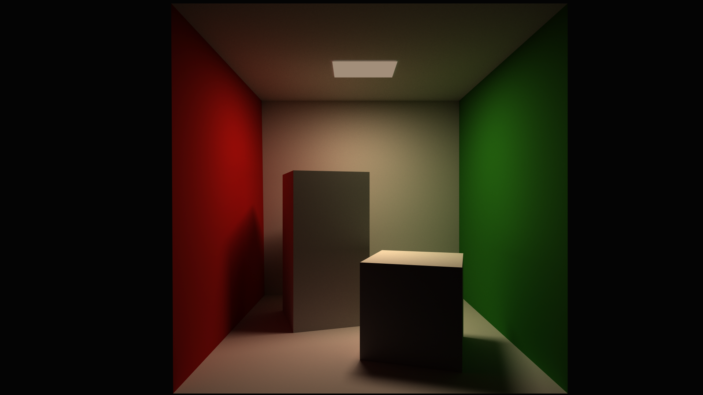

# Orion
Simple raytracer.

# Requirements
## general
- OpenGL 3.3 compatible hardware*
- g++ (with c++17 support)
- make
## libs
- GLEW*
- glfw3*
- GL*
- GLU*
- assimp
## other
- GLM*
- GLAD* (Included in this repository for GL 3.3 Core)
- tqdm.cpp (See Setup below)

`*` - denotes libraries required by viewer and are not necessary for the raytracer.

`NOTE:` If you are compiling libraries from sources remember to modify `LDPATHS` in Makefile to contain paths with compiled libs.

# Building and running
## Setup
1. Download tqdm.cpp submodule
    
    `@> git submodule update --init --recursive`
## Raytracer
1. `@> make raytracer`
2. `@> ./build/raytracer --help` to get list of commands
    - To use raytracer with point lights defined in rtc file: `./build/raytracer path/to/scene.rtc`
    - If no point lights are defined, BRDF pathtracer will run
## Viewer
1. `@> make viewer`
2. `@> ./build/rviewer path/to/config.rtc`

# Cornell Box render

Parameters used for this render:
- max depth = 100
- samples per pixel = 2048
- light samples = 2
- resolution = 1920x1080
Render time: 5126.4s (roughly 1h25m)